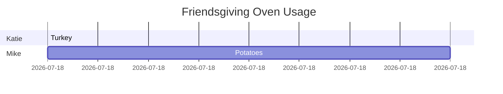

This text file turns into an HTML gantt chart. View that chart [here](https://rawgit.com/mogenson/friendsgiving-oven-usage/master/gantt.html).

The chart is written in Markdown using [mermaid](https://knsv.github.io/mermaid/).

The HTML is generated with [Typora](http://www.typora.io/).